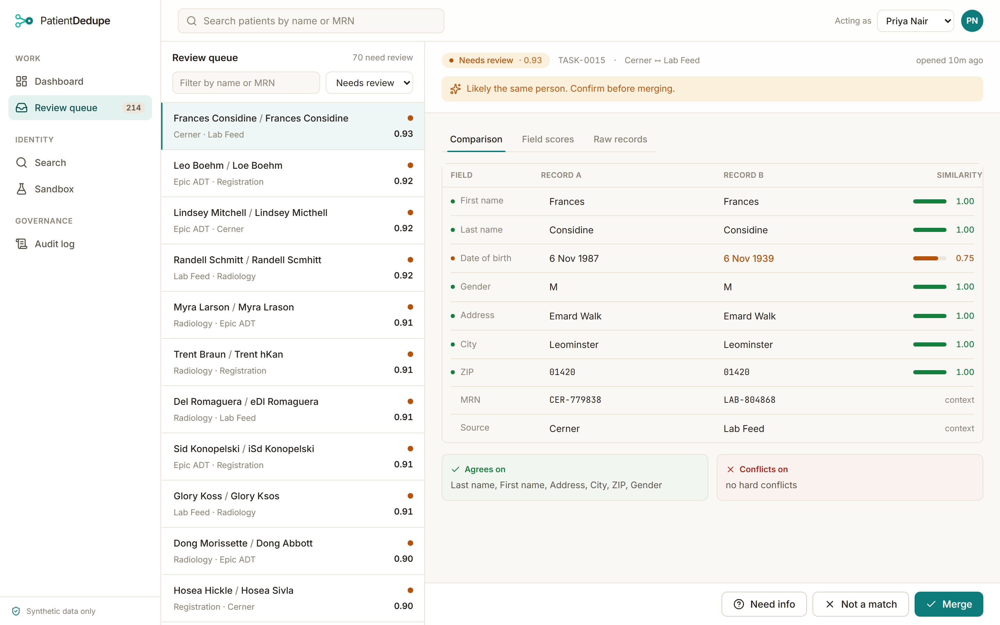
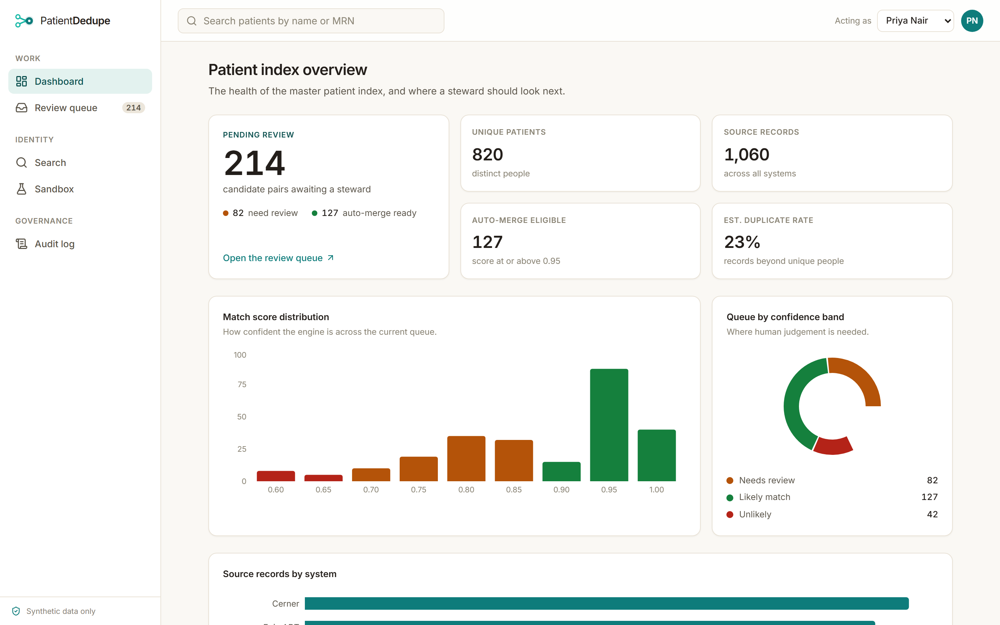
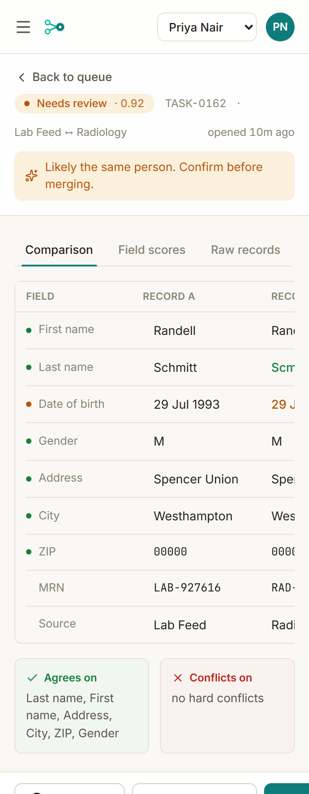
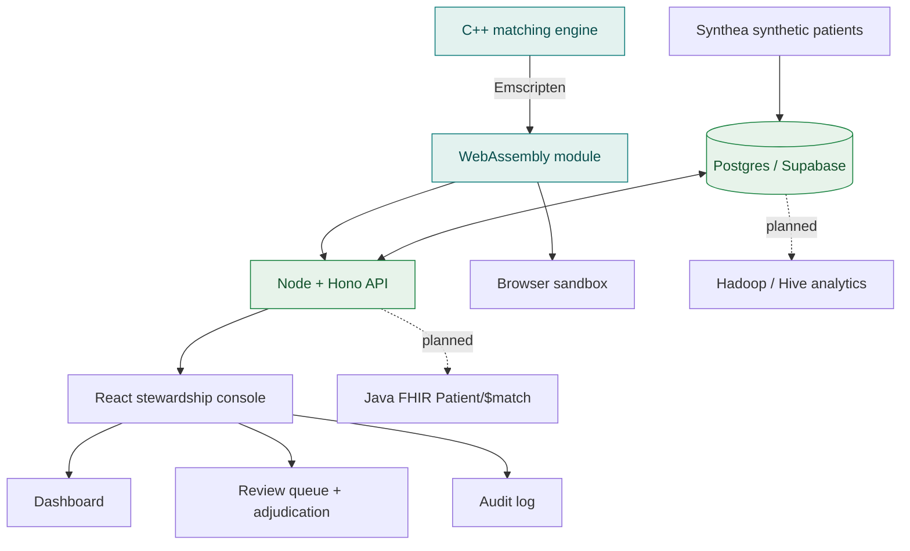

# PatientDedupe

A patient identity-resolution service (an Enterprise Master Patient Index) with a
hand-written C++ matching engine, a real stewardship console for the humans who
adjudicate duplicates, a Node + Postgres API, and a Hadoop/Hive analytics layer over
a synthetic patient population.

In healthcare the same person routinely ends up with more than one record, because
details get entered differently each time (Bob vs Robert, a transposed digit in a
date of birth, a surname that changed after marriage) and there is no national
patient identifier. That is dangerous: an allergy or a lab result can sit under the
wrong record. PatientDedupe scores how likely two records are the same person,
auto-merges the clear cases, and routes the uncertain ones to a human steward with a
field-by-field explanation they can audit.

## Live demo

**[Open the live console](https://huggingface.co/spaces/Sehajgill/PatientDedupe)** -
a real, working product on synthetic data (it sleeps when idle and wakes on the first
visit).



The review queue and side-by-side adjudication screen: confidence band, field-by-field
agreement and conflict, and Merge / Not a match / Need info.

## The product: a data steward's workspace

The console is the product; the matching engine is the service underneath it.

- **Dashboard** - the health of the patient index: pending review (the lead number),
  unique patients, source records, auto-merge-eligible count, duplicate rate, and
  charts for score distribution, queue by confidence band, and records by source
  system.
- **Review queue + adjudication** - a ranked queue (defaulting to the cases that need
  a human), with a side-by-side field diff (green agree, amber partial, red conflict),
  a reason-aware recommendation, a golden-record survivorship preview on merge, and
  decide-and-advance.
- **Audit log** - who decided what, when, and why. No merge is anonymous.
- **Search**, and a **Sandbox** that runs the engine live in your browser.



It is responsive down to small phone screens, including the Fold cover display:



## Why it matters, and who it is for

Patient matching is a recognized patient-safety and cost problem, and it sits inside
current US interoperability rules: CMS-0057-F has operational provisions that began on
January 1, 2026 and requires four FHIR APIs to be live by January 1, 2027. You cannot
safely exchange a record between systems if you cannot tell which patient it belongs
to. (Industry context that motivates the project, not numbers measured here.)

It is built for Priya, a senior integration engineer whose recurring nightmare is
duplicate-patient chaos during admission surges. It is also a portfolio project that
exercises four core skills in one product: C++ (the matching core), SQL (storage,
blocking, audit, and the Hive analytics), Java (a planned FHIR API), and Hadoop
(planned population analytics).

## Architecture



The same C++ engine is compiled to WebAssembly and used in three places: the browser
sandbox, the Node API (so the server and the client score identically), and the
native build used for tests and benchmarks. The live demo runs as a Hugging Face
Docker Space serving the API and the built frontend, with Postgres on Supabase.

## Results (measured here)

Single-threaded, on a development machine, scored with the full per-field reason
breakdown for every pair. Absolute throughput varies with machine load.

| Metric | Result |
| --- | --- |
| C++ engine throughput | about 140,000 to 200,000 candidate pairs/sec |
| Python baseline throughput | a few thousand pairs/sec |
| Speedup | roughly 30x or more, and the C++ side also builds the reasons the baseline skips |
| Precision at the auto-merge threshold (0.95) | 1.000 (zero false merges) |
| Recall at the auto-merge threshold (0.95) | 0.847 |
| Precision and recall at the review threshold (0.80) | 1.000 and 0.997 |

Correctness is measured against ground truth: the duplicates are manufactured from
real Synthea patients by a duplicate injector that records which messy copy came from
which original. At the auto-merge threshold there are zero false merges, the
safety-critical number, and at the review threshold nearly every real duplicate is
surfaced for a human, with no false positives.

## How the matcher works

- Three string metrics, hand-written in C++: Jaro-Winkler (good for names),
  Levenshtein, and Damerau-Levenshtein (which counts an adjacent digit swap, like a
  fat-fingered date, as a single edit).
- Date-of-birth logic that treats typos and transposed digits as partial rather than
  total mismatches, and a nickname table so Bob and Robert resolve to the same person.
- A tunable weighted score that always returns a per-field reason breakdown.
- Non-overlapping bands: at or above 0.95 a pair is confident enough to auto-merge,
  0.80 to 0.95 goes to a human, and below 0.80 is treated as different people.

## Tech stack

Versions confirmed current as of 2026-06-26.

| Area | Choice | Version |
| --- | --- | --- |
| Matching core | GCC (MinGW-w64, UCRT) | g++ 16.1.0 |
| C++ build / tests | CMake / Catch2 | 4.3.3 / 3.15.1 |
| WebAssembly | Emscripten | 6.0.1 |
| Synthetic data | Synthea | v4.0.0 |
| API | Node + Hono + postgres | Hono 4.12, postgres 3.4 |
| Frontend | Vite + React + TypeScript + Tailwind v4 | Vite 8.1, React 19 |
| UI libraries | Radix, TanStack Table + Query, Recharts, lucide, sonner | current |
| End-to-end and screenshots | Playwright | 1.61.0 |
| Database | Postgres (Supabase) | 17 |
| Deploy | Hugging Face Docker Space | - |
| FHIR API (planned) | Java + HAPI FHIR | - |
| Analytics (planned) | Apache Hadoop + Hive | - |

## Project status

- [x] **Phase 0** - Setup, toolchain, Synthea data, live deploy pipeline.
- [x] **Phase 1** - C++ matching core: hand-rolled metrics, a weighted explainable
  score, unit tests, a benchmark vs a Python baseline, and precision/recall.
- [x] **Product** - the stewardship console (dashboard, review queue, audit, search,
  sandbox) on a Node + Postgres API, deployed live, with the engine running as
  WebAssembly on both tiers.
- [ ] **Phase 2** - SQL blocking layer at population scale.
- [ ] **Phase 3** - Java HAPI FHIR `Patient/$match` facade.
- [ ] **Phase 5** - Hadoop / Hive duplicate-rate-by-site analytics at two scales.

## Build and run

The C++ engine, tests, benchmark, and evaluator:

```
cd engine
cmake -S . -B build -DCMAKE_BUILD_TYPE=Release
cmake --build build
./build/pdd_tests
./build/pdd_bench
./build/pdd_eval ../data/pairs.csv
```

The API and database (local):

```
cd backend
docker compose up -d           # local Postgres
cp .env.example .env           # or point DATABASE_URL at Supabase
npm install
npm run migrate && npm run seed
npm run dev                    # API on :8787
```

The frontend:

```
cd frontend
npm install
npm run dev                    # console on :5173, proxies /api to :8787
```

The whole thing builds into one container via the `Dockerfile` (it compiles the wasm
from source with Emscripten, builds the frontend, and runs the API), which is how the
Hugging Face Space is deployed on every push.

## Synthetic data and responsible use

No real patient data is ever used. All records come from
[Synthea](https://github.com/synthetichealth/synthea), which avoids HIPAA and
credentialing friction and gives ground truth to measure accuracy against. Any future
LLM use stays strictly administrative and human-in-the-loop, never autonomous clinical
decision-making.

## Benchmark honesty

Published research numbers are motivation only and are kept separate from anything
this project measures itself. The matcher is reported on both correctness (precision
and recall against Synthea's known identities) and speed (pairs per second versus a
Python baseline). All numbers above were measured on a single development machine and
vary with hardware and load.
