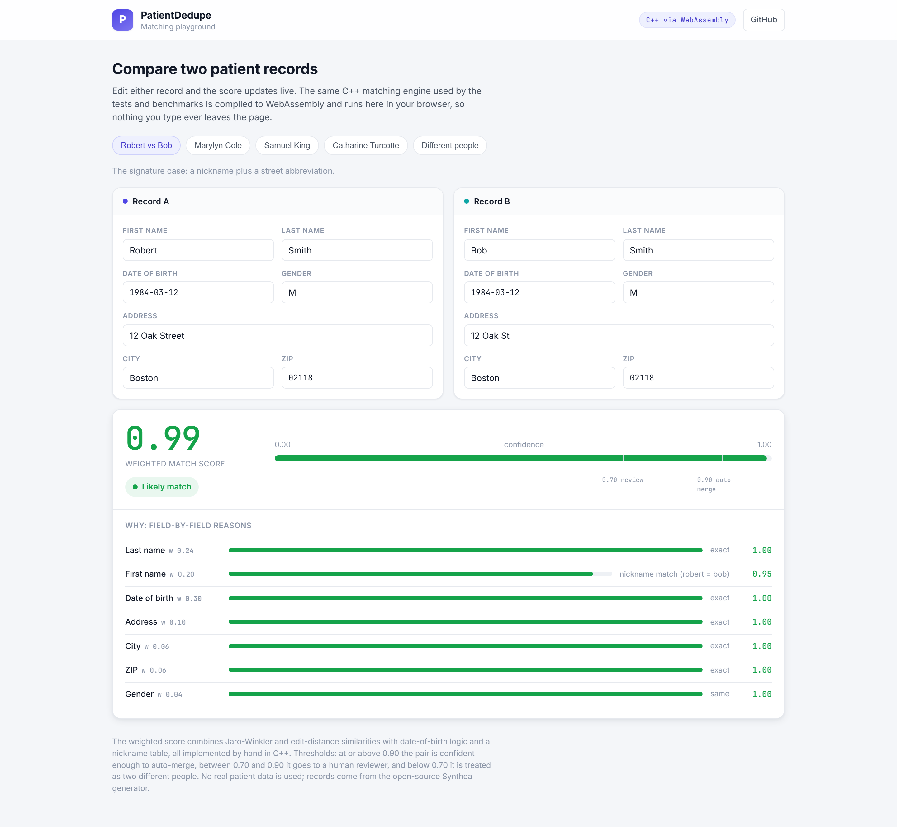
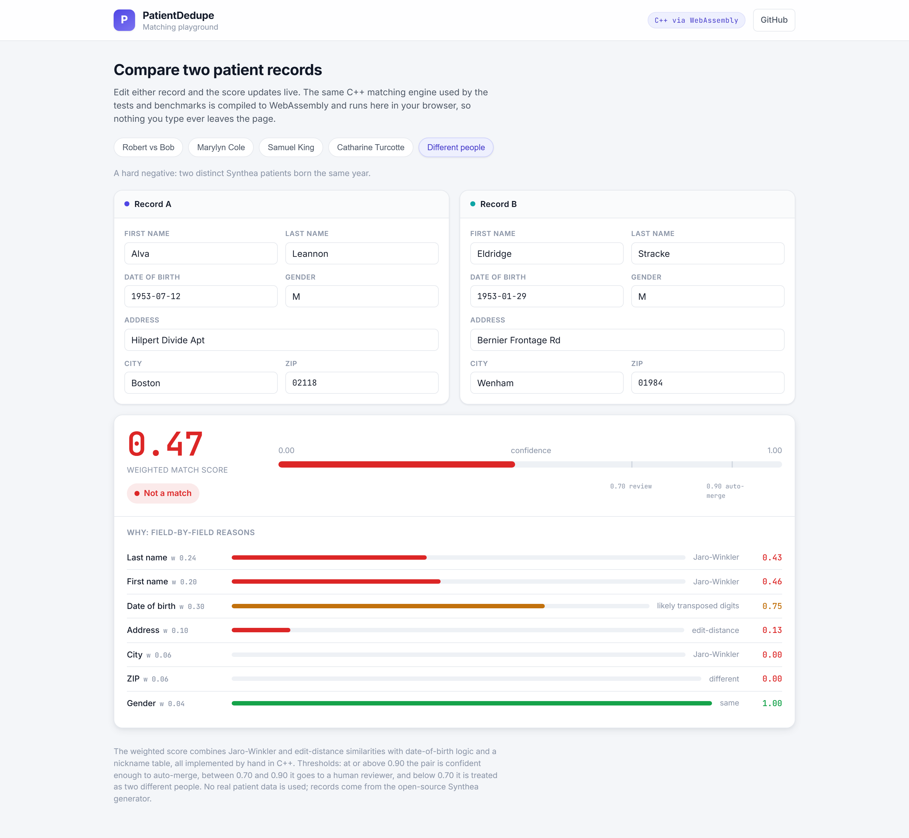

# PatientDedupe

A fast, explainable patient record-matching service: a C++ matching core, real SQL
blocking, a FHIR `Patient/$match` API, a human review console, and a Hadoop/Hive
analytics layer over a synthetic patient population.

PatientDedupe is an Enterprise Master Patient Index (EMPI), also called a
record-linkage system. In healthcare the same real person often ends up with two or
more separate records because their details were typed slightly differently each
time (Bob vs Robert, a transposed digit in a date of birth, a changed last name).
That is dangerous, because an allergy or a test result can get filed under the wrong
record. PatientDedupe finds those likely-duplicate records, scores how confident it
is that two records are the same person, auto-merges the obvious ones, and sends the
uncertain ones to a human to review with a clear explanation of why they were
flagged.

## Live demo

The matching playground runs the real C++ engine, compiled to WebAssembly, entirely
in your browser. Edit either record and the score updates live with a field-by-field
breakdown. Nothing you type leaves the page.

**[Open the live playground](https://huggingface.co/spaces/Sehajgill/PatientDedupe)**



A clear non-match, showing how the per-field reasons and the confidence meter respond:



## The problem

In US healthcare the same person routinely ends up with more than one medical record.
Details get entered differently on each visit (Bob instead of Robert, a transposed
digit in a date of birth, a surname that changed after marriage), and there is no
national patient identifier to tie those records back together. The result is a
fragmented view of a single human spread across several record numbers.

That is not just untidy, it is dangerous. An allergy, an active medication, or a
critical lab result can sit in one record while the clinician is looking at the
other. The job of an Enterprise Master Patient Index is to find those duplicates,
decide with calibrated confidence when two records are the same person, merge the
clear cases automatically, and route the uncertain ones to a human with an
explanation they can audit.

## Why it matters now

Patient matching is a recognized patient-safety and cost problem, and it sits
squarely inside current US interoperability rules. CMS-0057-F, the federal
Interoperability and Prior Authorization rule, has operational provisions that began
on January 1, 2026 and requires four FHIR APIs to be live by January 1, 2027. You
cannot safely exchange a patient's record between systems if you cannot reliably tell
which patient it belongs to. These are industry facts that motivate the project, not
numbers this project measures itself.

## Why it was built

PatientDedupe is a portfolio project with a real engineering spine. It exists to
demonstrate, end to end, a believable healthcare data system and to back it with
honest measurements rather than claims. It deliberately exercises four core skills in
one product: C++ for a performance-critical matching core, SQL for blocking, storage,
and audit, Java for a standard FHIR API, and Hadoop with Hive for population-scale
analytics. It runs entirely on synthetic data so the whole thing can be open,
reproducible, and free of privacy or credentialing friction.

## Architecture

```mermaid
flowchart TD
    A["Synthea<br/>synthetic patients"] --> B["Postgres<br/>match fields + blocking keys"]
    B --> C["SQL blocking layer<br/>phonetic keys, partitioning, indexes"]
    C -->|candidate pairs| D["C++ matching engine<br/>Jaro-Winkler, Levenshtein,<br/>Damerau-Levenshtein, DOB logic,<br/>nickname table, weighted score"]
    D --> W["WebAssembly build<br/>(Emscripten)"]
    W --> P["Browser playground<br/>live, no server"]
    D --> E["Match results, scores,<br/>and audit trail (SQL)"]
    E --> F["Java FHIR service<br/>HAPI, Patient/&#36;match"]
    E --> G["Web review console<br/>steward merges / rejects"]
    E --> H["Hadoop / Hive analytics<br/>duplicate rate by site"]

    classDef core fill:#eef0fe,stroke:#4f46e5,color:#1e1b4b;
    classDef data fill:#eafaf1,stroke:#15a34a,color:#064e3b;
    class D core;
    class B,E data;
```



The same C++ engine is used three ways: native (tests and benchmarks), as a
WebAssembly module (the live playground), and, in later phases, behind the Java FHIR
API. There is one implementation of the matching logic, never a re-implementation.

## Phase 1 results (measured here)

Single-threaded, on this development machine, scored with the full per-field reason
breakdown produced for every pair.

| Metric | Result |
| --- | --- |
| C++ engine throughput | about 209,000 candidate pairs/sec |
| Python baseline throughput | about 6,400 pairs/sec |
| Speedup | roughly 33x, and the C++ side also builds the reasons the baseline skips |
| Precision at the auto-merge threshold (0.90) | 1.000 (zero false merges) |
| Recall at the auto-merge threshold (0.90) | 0.983 |
| Recall at the review threshold (0.70) | 1.000 (every true duplicate is caught) |

Correctness is measured against ground truth: the duplicates are manufactured from
real Synthea patients by `tools/duplicate_injector.py`, which records exactly which
messy copy came from which original. At the auto-merge threshold there are no false
merges, which is the safety-critical number, and at the review threshold every real
duplicate is surfaced for a human to see.

## How the matcher works

- Three string metrics, implemented by hand in C++: Jaro-Winkler (good for names),
  Levenshtein, and Damerau-Levenshtein (which counts an adjacent transposition, like
  a fat-fingered date, as a single edit).
- Date-of-birth logic that treats typos and transposed digits as partial, not total,
  mismatches, and floors the score when the birth year matches.
- A small nickname table so "Bob" and "Robert" resolve to the same person, which is
  the exact failure mode the project is named for.
- A tunable weighted score that always returns a per-field reason breakdown, so every
  decision is explainable and auditable.
- Thresholds: at or above 0.90 a pair is confident enough to auto-merge, between 0.70
  and 0.90 it goes to a human reviewer, and below 0.70 it is treated as two different
  people.

## Project status

- [x] **Phase 0 - Setup and understanding.** Toolchain, Synthea v4.0.0 data, and a
  live deploy pipeline.
- [x] **Phase 1 - C++ matching core.** Hand-rolled metrics, a weighted explainable
  score, unit tests, a benchmark against a Python baseline, precision and recall
  against ground truth, and an in-browser WebAssembly playground.
- [ ] **Phase 2 - SQL blocking and storage.** Phonetic blocking keys, partitioning,
  indexing, and a full audit trail.
- [ ] **Phase 3 - Java FHIR API.** A HAPI FHIR `Patient/$match` endpoint.
- [ ] **Phase 4 - Review console.** A polished stewardship UI with Playwright tests.
- [ ] **Phase 5 - Hadoop / Hive analytics.** Duplicate rate by site, at two scales.

## Build and run

The C++ engine, tests, benchmark, and evaluator:

```
cd engine
cmake -S . -B build -DCMAKE_BUILD_TYPE=Release
cmake --build build
./build/pdd_tests      # unit tests
./build/pdd_bench      # throughput benchmark
./build/pdd_eval ../data/pairs.csv   # precision and recall
```

The evaluation set and the Python baseline:

```
python tools/duplicate_injector.py            # writes data/pairs.csv
python tools/baseline/baseline.py             # Python throughput, for comparison
```

The frontend playground:

```
cd frontend
npm install
npm run dev       # local dev server
npm run build     # production build into frontend/dist
```

The WebAssembly module (`frontend/src/wasm/matcher.js`) is built from the C++ engine
with Emscripten and committed so the frontend builds without the C++ toolchain.

## Stack

Versions confirmed current as of 2026-06-26.

| Area | Choice | Version |
| --- | --- | --- |
| Matching core | GCC (MinGW-w64, UCRT) | g++ 16.1.0 |
| Build system | CMake | 4.3.3 |
| C++ unit tests | Catch2 | 3.15.1 |
| WebAssembly | Emscripten | 6.0.1 |
| Synthetic data | Synthea | v4.0.0 |
| Frontend | Vite + React + TypeScript | Vite 8.1, React 19 |
| End-to-end and screenshots | Playwright | 1.61.0 |
| FHIR API (Phase 3) | Java + HAPI FHIR | JDK 26, HAPI 8.x |
| Analytics (Phase 5) | Apache Hadoop + Hive | to be pinned |

## Synthetic data and responsible use

No real patient data is ever used. All records come from
[Synthea](https://github.com/synthetichealth/synthea), an open-source synthetic
patient generator, which avoids HIPAA and credentialing friction and gives ground
truth to measure accuracy against. Any future LLM use stays strictly administrative
and human-in-the-loop, never autonomous clinical decision-making.

## Benchmark honesty

Published research numbers are motivation only and are kept separate from anything
this project measures itself. For the matcher we report both correctness (precision
and recall against Synthea's known identities) and speed (pairs per second versus a
Python baseline). All Phase 1 numbers above were measured on a single development
machine and will vary on other hardware.
