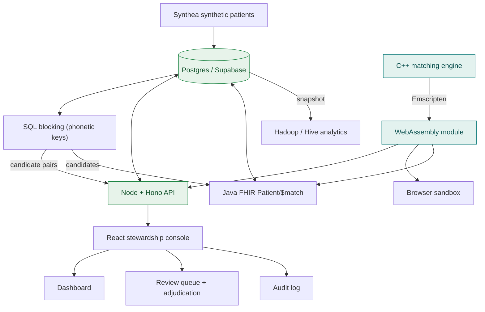

# PatientDedupe

A patient identity-resolution service (an Enterprise Master Patient Index) with a
hand-written C++ matching engine, a real stewardship console for the humans who
adjudicate duplicates, a Node + Postgres API, and a Hadoop/Hive analytics layer over
a synthetic patient population.

In healthcare the same person routinely ends up with more than one record, because
details get entered differently each time (Bob vs Robert, a transposed digit in a
date of birth, a surname that changed after marriage) and there is no national
patient identifier. That is dangerous: an allergy or a lab result can sit under the
wrong record. PatientDedupe scores how likely two records are the same person,
auto-merges the clear cases, and routes the uncertain ones to a human steward with a
field-by-field explanation they can audit.

## Live demo

**[Open the live console](https://huggingface.co/spaces/Sehajgill/PatientDedupe)** -
a real, working product on synthetic data (it sleeps when idle and wakes on the first
visit).


The review queue and side-by-side adjudication screen: confidence band, field-by-field
agreement and conflict, and Merge / Not a match / Need info.

## The product: a data steward's workspace

The console is the product; the matching engine is the service underneath it.

- **Dashboard** - the health of the patient index: pending review (the lead number),
  unique patients, source records, auto-merge-eligible count, duplicate rate, and
  charts for score distribution, queue by confidence band, and records by source
  system.
- **Review queue + adjudication** - a ranked queue (defaulting to the cases that need
  a human), with a side-by-side field diff (green agree, amber partial, red conflict),
  a reason-aware recommendation, a golden-record survivorship preview on merge, and
  decide-and-advance. It is keyboard-first: a Cmd/Ctrl+K command palette jumps between
  screens, and j/k move through the queue while m/n/i merge, reject, or flag.
- **Audit log** - who decided what, when, and why. No merge is anonymous, and every merge
  is reversible: an unmerge restores the records and reopens the pair.
- **Bulk auto-merge** of the high-confidence (>= 0.95) pairs in one identified action.
- **Search**, and a **Sandbox** that runs the engine live in your browser.

The screens carry no serious or critical accessibility violations (WCAG 2 AA), checked by
axe in CI.


It is responsive down to small phone screens, including the Fold cover display:


## Why it matters, and who it is for

Patient matching is a recognized patient-safety and cost problem, and it sits inside
current US interoperability rules: CMS-0057-F has operational provisions that began on
January 1, 2026 and requires four FHIR APIs to be live by January 1, 2027. You cannot
safely exchange a record between systems if you cannot tell which patient it belongs
to. (Industry context that motivates the project, not numbers measured here.)

It is built for Priya, a senior integration engineer whose recurring nightmare is
duplicate-patient chaos during admission surges. It is also a portfolio project that
exercises four core skills in one product: C++ (the matching core), SQL (storage,
blocking, audit, and the Hive analytics), Java (a planned FHIR API), and Hadoop
(planned population analytics).

## Architecture



The same C++ engine is compiled to WebAssembly and used in four places from one
implementation: the browser sandbox, the Node API (so the server and the client score
identically), the native build used for tests and benchmarks, and the Java FHIR
service, which loads the very same wasm into the JVM. The live demo runs as Hugging
Face Docker Spaces (the Node console and the Java FHIR API) with Postgres on Supabase.

## FHIR Patient/$match API

Other systems do not call PatientDedupe through a bespoke API; they call the standard
FHIR `Patient/$match` operation. A Java service built on HAPI FHIR exposes it, reusing
the same engine and the same SQL blocking layer underneath.

The single source of truth is preserved in the strongest way: the Java service does not
re-implement any matching math. It loads the identical Emscripten-compiled engine into
the JVM through a pure-Java WebAssembly runtime (Chicory) and calls it in process, so the
exact same compiled binary runs in the browser, in the Node API, and in the JVM. The
match grade it returns is mapped from the engine's own label, so the confidence bands
stay defined only in the C++.

A real call against the live synthetic data, probing with a typo (`Abdoul`) and an
abbreviated street (`Fay Jct`) for a record stored as `Abdul Schoen, Fay Junction`:

```
POST /fhir/Patient/$match
{"resourceType":"Parameters","parameter":[{"name":"resource","resource":{
  "resourceType":"Patient","name":[{"family":"Schoen","given":["Abdoul"]}],
  "birthDate":"2000-05-31","gender":"male",
  "address":[{"line":["Fay Jct"],"city":"Lunenburg","postalCode":"01462"}]}}]}
```

returns a searchset `Bundle` whose entry is the real record, with a calculated score and
the standard match-grade extension:

```
search.score  = 0.9506
match-grade   = certain
identifier    = urn:patientdedupe:source:Lab Feed | LAB-439696
```

The response carries the source-system identifier so the caller can resolve the record,
and never the synthetic ground-truth key.

## Hadoop analytics: duplicate rate by site

A population-level question the console cannot answer: which registration sites produce
the most duplicate records? A hand-written Java MapReduce job answers it, with the same
logic expressed as a HiveQL twin. It is two chained MapReduce passes (label each record as
primary or duplicate by grouping on the ground-truth person key, then aggregate per site)
run on a single-node Hadoop (HDFS + YARN) in Docker, with a local-mode fallback.

On the development population the MapReduce job, run on YARN, reports (worst first):

```
Epic ADT      220 records   54 duplicates   0.2455
Registration  200 records   48 duplicates   0.2400
Lab Feed      199 records   45 duplicates   0.2261
Cerner        233 records   51 duplicates   0.2189
Radiology     208 records   42 duplicates   0.2019
```

The 240 duplicates are exactly the number injected, spread across the sites that
re-registered them. The HiveQL twin computes the same numbers; a test runs the identical
SQL and checks it against the canonical logic.

It is single-node, stated plainly. Wall-clock is measured at increasing scales (the
snapshots beyond 1k are generated reproducibly with the same injection rate):

| Scale | Local mode | On YARN |
| --- | --- | --- |
| ~1k records | ~19 s | ~136 s |
| ~100k records | ~19 s | - |
| ~1M records | ~39 s | - |

The honest reading: at small sizes a fixed startup cost dominates (local mode ~18 s of JVM
and framework startup; YARN far more, from per-job container scheduling), so 1k and 100k
take about the same wall-clock in local mode. Only at ~1M does the per-record compute
become visible. This is the point of running it at two scales rather than quoting one
number: on a single node the overhead is real and worth showing, not hiding.

## Results (measured here)

Single-threaded, on a development machine, scored with the full per-field reason
breakdown for every pair. Absolute throughput varies with machine load.

| Metric | Result |
| --- | --- |
| C++ engine throughput | about 140,000 to 200,000 candidate pairs/sec |
| Python baseline throughput | a few thousand pairs/sec |
| Speedup | roughly 30x or more, and the C++ side also builds the reasons the baseline skips |
| Precision at the auto-merge threshold (0.95) | 1.000 (zero false merges) |
| Recall at the auto-merge threshold (0.95) | 0.847 |
| Precision and recall at the review threshold (0.80) | 1.000 and 0.997 |
| SQL blocking: comparison reduction | about 99.9% (roughly 300 candidates from ~561,000 possible pairs) |
| SQL blocking: recall | about 92% of true duplicates retained in the candidate set |

Correctness is measured against ground truth: the duplicates are manufactured from
real Synthea patients by a duplicate injector that records which messy copy came from
which original. At the auto-merge threshold there are zero false merges, the
safety-critical number, and at the review threshold nearly every real duplicate is
surfaced for a human, with no false positives.

## How the matcher works

- Three string metrics, hand-written in C++: Jaro-Winkler (good for names),
  Levenshtein, and Damerau-Levenshtein (which counts an adjacent digit swap, like a
  fat-fingered date, as a single edit).
- Date-of-birth logic that treats typos and transposed digits as partial rather than
  total mismatches, and a nickname table so Bob and Robert resolve to the same person.
- A tunable weighted score that always returns a per-field reason breakdown.
- Non-overlapping bands: at or above 0.95 a pair is confident enough to auto-merge,
  0.80 to 0.95 goes to a human, and below 0.80 is treated as different people.

## SQL blocking

Comparing every record to every other is N-squared, so a Postgres blocking layer
generates only candidate pairs that share a blocking key. It uses phonetic keys
(dmetaphone, via the fuzzystrmatch extension) on names and partitions on birth year
and surname prefix, combining several strategies with a union and backing every join
with a functional index. The matcher scores only those candidates. It is measured both
ways: how much it cuts the comparisons, and how many true duplicates the candidate set
still contains. The SQL lives in `sql/`.

## Tech stack

Versions confirmed current as of 2026-06-26.

| Area | Choice | Version |
| --- | --- | --- |
| Matching core | GCC (MinGW-w64, UCRT) | g++ 16.1.0 |
| C++ build / tests | CMake / Catch2 | 4.3.3 / 3.15.1 |
| WebAssembly | Emscripten | 6.0.1 |
| Synthetic data | Synthea | v4.0.0 |
| API | Node + Hono + postgres | Hono 4.12, postgres 3.4 |
| Frontend | Vite + React + TypeScript + Tailwind v4 | Vite 8.1, React 19 |
| UI libraries | Radix, TanStack Table + Query, Recharts, lucide, sonner | current |
| API + blocking tests | Vitest + Testcontainers | 4.1.9 / 12.0.3 |
| End-to-end and screenshots | Playwright | 1.61.1 |
| Database | Postgres (Supabase) | 17 |
| Deploy | Hugging Face Docker Space | - |
| FHIR API | Java + HAPI FHIR, Jetty, JDBC | HAPI 8.10.0, Jetty 12.1.10, JDK 17 |
| FHIR engine reuse | Chicory (wasm in the JVM) | 1.7.5 |
| FHIR tests | JUnit + Testcontainers | 5.14.4 / 2.0.5 |
| Analytics | Apache Hadoop (Java MapReduce) + HiveQL, on JDK 8 | Hadoop 3.4.3 |
| Analytics tests | JUnit + H2 (SQL parity) | 5.14.4 / 2.4.240 |

## Project status

- [x] **Phase 0** - Setup, toolchain, Synthea data, live deploy pipeline.
- [x] **Phase 1** - C++ matching core: hand-rolled metrics, a weighted explainable
  score, unit tests, a benchmark vs a Python baseline, and precision/recall.
- [x] **Product** - the stewardship console (dashboard, review queue, audit, search,
  sandbox) on a Node + Postgres API, deployed live, with the engine running as
  WebAssembly on both tiers.
- [x] **Phase 2** - SQL blocking layer: phonetic keys (dmetaphone), partitioning, and
  functional indexes, with the comparison reduction and blocking recall measured and
  shown on the dashboard.
- [x] **Phase 3** - Java HAPI FHIR `Patient/$match` facade, reusing the SQL blocking
  layer for candidates and running the same C++ engine as WebAssembly inside the JVM.
- [x] **Phase 5** - Hadoop analytics: a hand-written Java MapReduce job (with a HiveQL
  twin) computing duplicate rate by registration site, on a single-node HDFS + YARN
  cluster, measured at increasing scales.
- [x] **Automated tests** - backend API and blocking integration tests (Vitest against a
  Testcontainers Postgres) and Playwright end-to-end tests of the review console,
  including the five safety flows, run in CI.

## Testing

Every layer has tests that cite the specs they verify:

- **Engine** - Catch2 unit tests, plus a benchmark and a precision/recall evaluator.
- **API and blocking** - Vitest drives the real routes against a throwaway Postgres
  (Testcontainers), covering the queue, decisions, golden records, audit, dashboard, and
  search, and asserting the blocking layer only pairs key-sharing records, rides
  functional indexes, and captures the known duplicates.
- **Review console** - Playwright end-to-end tests run the whole stack and exercise the
  five safety-critical flows (the queue loads with the score-and-reason breakdown; a
  merge previews the surviving golden record then writes it and an audit row; not-a-match
  suppresses the pair; the band filter narrows the queue; no merge is possible without an
  acting reviewer), plus unmerge, bulk auto-merge, and the keyboard palette. An axe-core
  test asserts no serious or critical accessibility violations on every screen.
- **FHIR and analytics** - JUnit, with the wasm engine run in the JVM, the blocking query
  against a real Postgres, and the HiveQL twin checked against the MapReduce result.

A GitHub Actions workflow runs the backend and end-to-end suites on every push.

## Build and run

The C++ engine, tests, benchmark, and evaluator:

```
cd engine
cmake -S . -B build -DCMAKE_BUILD_TYPE=Release
cmake --build build
./build/pdd_tests
./build/pdd_bench
./build/pdd_eval ../data/pairs.csv
```

The API and database (local):

```
cd backend
docker compose up -d           # local Postgres
cp .env.example .env           # or point DATABASE_URL at Supabase
npm install
npm run migrate && npm run seed
npm run dev                    # API on :8787
```

The frontend:

```
cd frontend
npm install
npm run dev                    # console on :5173, proxies /api to :8787
```

The automated tests (need Docker for the throwaway Postgres):

```
cd backend && npm test         # API + blocking, Vitest against Testcontainers
cd e2e && npm install && npx playwright install chromium && npm test   # console e2e
```

The whole thing builds into one container via the `Dockerfile` (it compiles the wasm
from source with Emscripten, builds the frontend, and runs the API), which is how the
Hugging Face Space is deployed on every push.

The FHIR API (Java):

```
# build the engine's C-ABI wasm the JVM loads (once, from the engine source)
em++ -O3 -std=c++17 -Iengine/include \
  engine/src/metrics.cpp engine/src/nicknames.cpp engine/src/matcher.cpp engine/wasm/c_abi.cpp \
  -sSTANDALONE_WASM=1 -sEXPORTED_FUNCTIONS=_pdd_alloc,_pdd_free,_pdd_match \
  -sALLOW_MEMORY_GROWTH=1 --no-entry -o fhir/src/main/resources/pdd_engine.wasm

cd fhir
mvn test                                          # unit tests
mvn test -Dtest.excludedGroups= "-Dtest=*IT"      # + wasm and Testcontainers tests (needs Docker)
mvn -DskipTests package                           # fat jar
DATABASE_URL=... PORT=8080 java -jar target/patientdedupe-fhir-0.1.0.jar
# POST /fhir/Patient/$match, capability at /fhir/metadata
```

The FHIR service ships as its own Hugging Face Docker Space via `Dockerfile.fhir` (it
compiles the same wasm from source and builds the fat jar), deployed on every push by
`deploy-fhir-space.yml`.

The Hadoop analytics job:

```
cd analytics
mvn -DskipTests package        # builds the job jar (Java 8 bytecode) on JDK 11
./run-cluster.sh 1k            # single-node HDFS + YARN, then: docker compose down
./run-local.sh 100k            # or local mode, no cluster
```

See `analytics/README.md` for the metric, the HiveQL twin, and the scale runs.

## Synthetic data and responsible use

No real patient data is ever used. All records come from
[Synthea](https://github.com/synthetichealth/synthea), which avoids HIPAA and
credentialing friction and gives ground truth to measure accuracy against. Any future
LLM use stays strictly administrative and human-in-the-loop, never autonomous clinical
decision-making.

## Benchmark honesty

Published research numbers are motivation only and are kept separate from anything
this project measures itself. The matcher is reported on both correctness (precision
and recall against Synthea's known identities) and speed (pairs per second versus a
Python baseline). All numbers above were measured on a single development machine and
vary with hardware and load.
