# PatientDedupe

A fast, explainable patient record-matching service: a C++ matching core, real SQL
blocking, a FHIR `Patient/$match` API, a human review console, and a Hadoop/Hive
analytics layer over a synthetic patient population.

PatientDedupe is an Enterprise Master Patient Index (EMPI), also called a
record-linkage system. In healthcare the same real person often ends up with two or
more separate records because their details were typed slightly differently each
time (Bob vs Robert, a transposed digit in a date of birth, a changed last name).
That is dangerous, because an allergy or a test result can get filed under the wrong
record. PatientDedupe finds those likely-duplicate records, scores how confident it
is that two records are the same person, auto-merges the obvious ones, and sends the
uncertain ones to a human to review with a clear explanation of why they were
flagged.

## The problem, and who this is for

Priya Nair is a senior integration engineer on the interoperability team at a
mid-size hospital network. Her recurring nightmare is duplicate-patient chaos during
admission surges: when the emergency department floods, registration clerks retype
patient details under pressure and the same human gets entered twice under two
different medical record numbers. A nurse calls at 7:40am because a just-admitted
patient's allergy list is not showing up, and it turns out the patient exists twice,
once as "Robert Smith" and once as "Bob Smith," with the allergy filed under the
other record. PatientDedupe is built for Priya: a matcher fast enough to run across
the whole population, that explains itself so she can trust and audit each merge.

Patient matching is a recognized patient-safety and cost problem, made worse because
the United States has no national patient identifier.

## Architecture

```mermaid
flowchart TD
    A["Synthea<br/>synthetic patients"] --> B["Postgres<br/>match fields + blocking keys"]
    B --> C["SQL blocking layer<br/>phonetic keys, partitioning, indexes"]
    C -->|candidate pairs| D["C++ matching engine<br/>Jaro-Winkler, Levenshtein,<br/>Damerau-Levenshtein, DOB logic,<br/>weighted score + field reasons"]
    D --> E["Match results, scores,<br/>and audit trail (SQL)"]
    E --> F["Java FHIR service<br/>HAPI, Patient/&#36;match"]
    E --> G["Web review console<br/>steward merges / rejects,<br/>sees field-by-field reasons"]
    E --> H["Hadoop / Hive analytics<br/>duplicate rate by site,<br/>run at 1k and 100k"]
    F --> I["Other systems call the API"]

    classDef core fill:#0b3d2e,stroke:#10b981,color:#e6fffa;
    classDef data fill:#0b2a4a,stroke:#3b82f6,color:#e6f0ff;
    class D core;
    class B,E data;
```

| Component | Skill | What it does |
| --- | --- | --- |
| Matching engine | C++ | Scores how similar two records are. The performance-critical core. |
| Blocking + storage | SQL | Decides which record pairs are worth comparing, stores decisions and an audit trail. |
| FHIR API | Java | Exposes the matcher as a standard FHIR `Patient/$match` operation. |
| Review console | Web | Lets a human steward see flagged pairs side by side and merge or reject them. |
| Analytics finale | Hadoop / Hive | Computes population-level metrics such as duplicate rate by registration site. |

## Tech stack

Versions confirmed current as of 2026-06-26.

| Area | Choice | Version |
| --- | --- | --- |
| Matching core | GCC (MinGW-w64, UCRT) | g++ 16.1.0 |
| Build system | CMake | 4.3.3 |
| C++ unit tests | Catch2 | pinned in Phase 1 |
| Synthetic data | Synthea | v4.0.0 |
| Database | Postgres (Neon or Supabase free tier) | Phase 2 |
| FHIR API | Java + HAPI FHIR | JDK 26, HAPI 8.x |
| Review console | Vite + React + Tailwind CSS + shadcn/ui | Phase 4 |
| End-to-end tests | Playwright | 1.61.0 |
| Analytics | Apache Hadoop + Hive | Phase 5 |

## Project status

This is built in phases. Each phase works and is documented before the next begins.

- [x] **Phase 0 - Setup and understanding.** Remote connected, toolchain installed
  and verified, Synthea v4.0.0 generating a 1000-patient development dataset,
  architecture documented.
- [ ] **Phase 1 - C++ matching core.** Hand-rolled string-similarity metrics, a
  tunable weighted score, correctness (precision and recall) and speed
  (pairs per second versus a Python baseline).
- [ ] **Phase 2 - SQL blocking and storage.** Phonetic blocking keys, partitioning,
  indexing, and a full audit trail.
- [ ] **Phase 3 - Java FHIR API.** A HAPI FHIR `Patient/$match` endpoint.
- [ ] **Phase 4 - Review console.** A polished stewardship UI with Playwright tests
  and screenshots.
- [ ] **Phase 5 - Hadoop / Hive analytics.** Duplicate rate by site, run at two
  scales.
- [ ] **Phase 6 (optional) - Garnish.** An LLM match explainer and n8n
  notifications, both administrative and human-in-the-loop only.

## Synthetic data and responsible use

No real patient data is ever used. All records come from
[Synthea](https://github.com/synthetichealth/synthea), an open-source synthetic
patient generator, which avoids HIPAA and credentialing friction and gives us
ground-truth identities to measure accuracy against. Any future LLM use stays
strictly administrative and human-in-the-loop (drafting a plain-language match
explanation or an audit note), never autonomous clinical decision-making.

## Benchmark honesty

Published research numbers are motivation only and are kept separate from anything
this project measures itself. For the matcher we report both correctness (precision
and recall against Synthea's known identities) and speed (pairs per second versus a
Python baseline). The CI pipeline can build the C++ engine and run unit tests,
microbenchmarks, and Playwright tests, but it cannot run the Hadoop job at scale, and
the README keeps those clearly separate.
